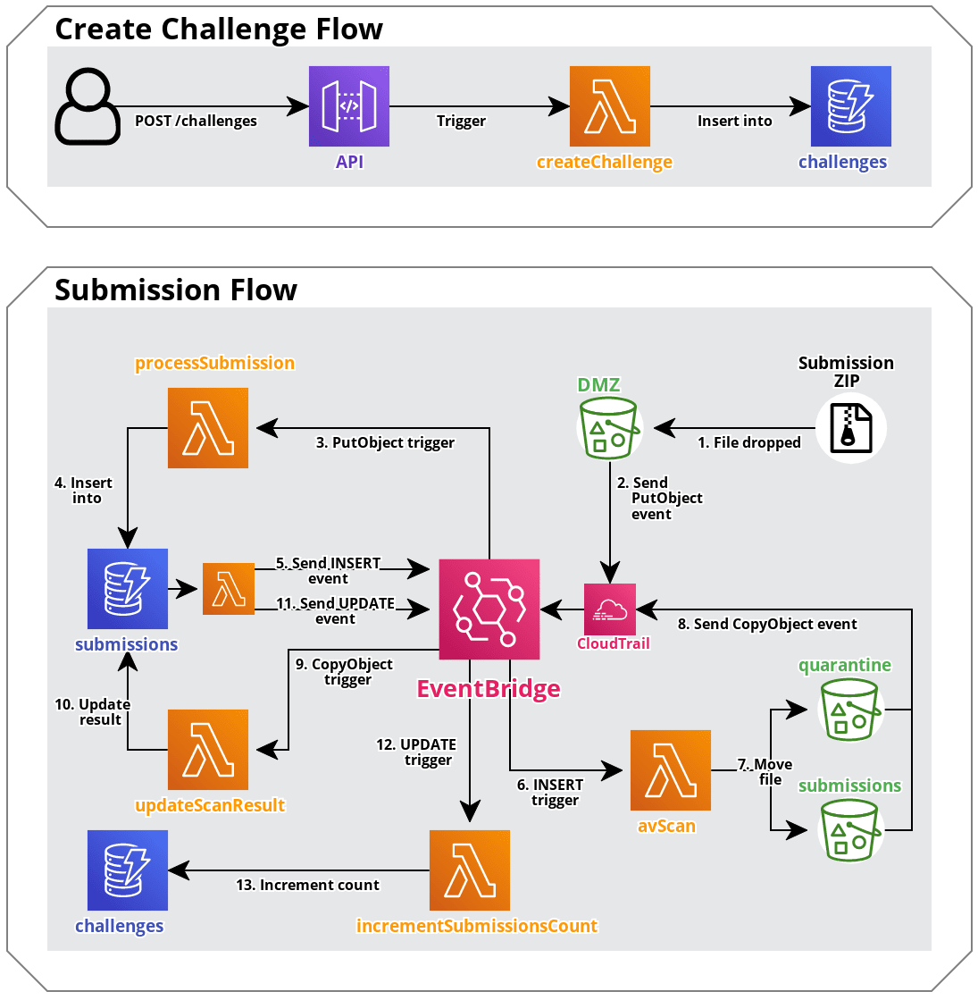

# Topcoder EventBridge PoC

Proof of concept application that processes challenge file submissions using AWS EventBridge.

## Install and deploy

- Requires [Node/NPM](https://nodejs.org/en/download/) and [Serverless Framework CLI](https://www.serverless.com/framework/docs/getting-started/) to be installed. Credentials for your AWS account will also need to be [configured](https://www.serverless.com/framework/docs/providers/aws/guide/credentials/).
- S3 bucket and DynamoDB table names can be set in `config.yml` (this may be necessary since bucket names need to be globally unique).
- Install dependencies:
  - `npm install`
- Deploy to AWS:
  - `serverless deploy`
- Take note of the API Gateway endpoint shown once deployed (e.g `https://xxxxxxxxxx.execute-api.us-east-1.amazonaws.com/dev`).
- Open Postman collection and update `endpoint` variable to the API Gateway endpoint.

## Testing the application

- Create a challenge - either:
  - Run the "New Challenge" request in Postman, or
  - `curl https://<REPLACEME>.execute-api.us-east-1.amazonaws.com/dev/challenges --data '{"name": "Test Challenge"}'`
- Take note of the ID of the challenge, and create a zip file to upload with the filename format: `<challenge_id>-<name>-<pass/fail>.zip`:
  - e.g. `touch xxxxxxxx-xxxx-xxxx-xxxx-xxxxxxxxxxxx-test-pass.zip`
- Upload the file to the DMZ bucket:
  - e.g. `aws s3 cp xxxxxxxx-xxxx-xxxx-xxxx-xxxxxxxxxxxx-test-pass.zip s3://topcoder-eventbridge-poc-submissions-dmz`
- Verify the submission has been created:
  - e.g. `aws dynamodb scan --table-name=submissions --region=us-east-1`
  - _It might take a minute for the submission to appear._
- Verify the submitted file has been moved to the appropriate bucket:
  - e.g. `aws s3 ls s3://topcoder-eventbridge-poc-submissions` or `aws s3 ls s3://topcoder-eventbridge-poc-submissions-quarantine`
  - _The file should be in the submissions bucket if the anti-virus scan passed, or in the quarantine bucket if it failed._
- Verify the anti-virus result is correct:
  - Re-run `aws dynamodb scan --table-name=submissions --region=us-east-1` until the `avScanPass` attribute is `true` or `false`.
  - _The result should match the final part of the filename - `-pass.zip` = `true` / `-fail.zip` = `false`._
- Verify the `numberOfSubmissions` attribute on the challenge has been incremented:
  - e.g. `aws dynamodb scan --table-name=challenges --region=us-east-1`

## Remove deployment

- When you are finished, you can remove all of the provisioned resources from your AWS account by running:
  - `serverless remove`
  - _If there are objects remaining in the S3 buckets, these will need to manually be removed before the bucket can be deleted._

## Project structure

- `/src`
  - `/handlers`
    - `/api`
      - `*.js` - Lambda function handlers for API Gateway routes
    - `/events`
      - `*.js` - Lambda function handlers for EventBridge events
  - `/schema`
    - `*.json` - API Gateway validation models
  - `config.yml` - Global bucket/table name variables
  - `serverless.yml` - Main Serverless Framework configuration file

## Notes

- CloudTrail only supports sending events directly to the `default` bus in EventBridge.
- DynamoDB does not support sending events directly to EventBridge.
  - As a solution, the [DynamoDB to EventBridge plugin](https://github.com/theburningmonk/serverless-dynamodb-to-eventbridge-plugin) is used here, which uses [DynamoDB Streams](https://docs.aws.amazon.com/amazondynamodb/latest/developerguide/Streams.html) to trigger a Lambda that forwards events to EventBridge.
  - An alternative would be to send an [EventBridge custom event](https://docs.aws.amazon.com/eventbridge/latest/APIReference/API_PutEvents.html) after writing to the database.
