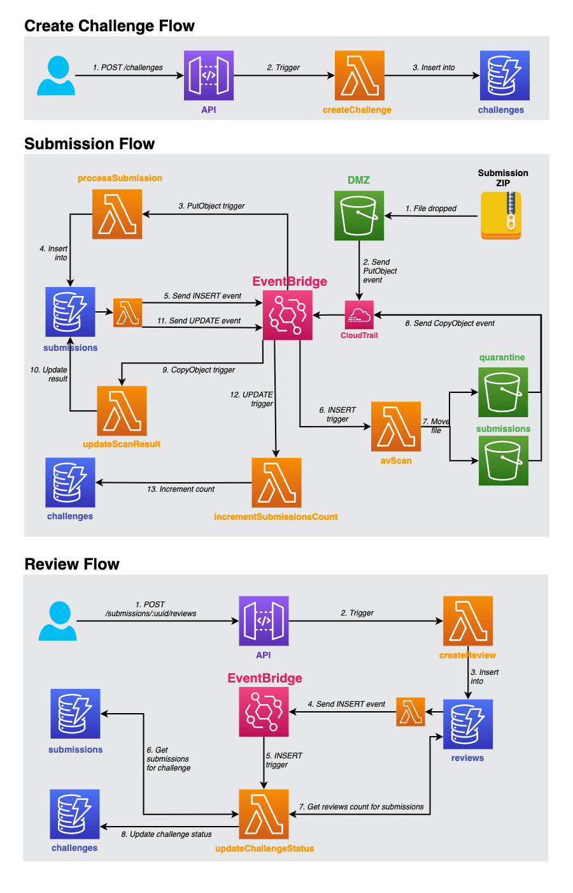

# Topcoder EventBridge PoC



Proof of concept application that processes schedule phases updates.

## Configuration
- AUTH0_URL: AUTH0 URL, used to get M2M token
- AUTH0_PROXY_SERVER_URL: AUTH0 proxy server URL, used to get M2M token
- AUTH0_AUDIENCE: AUTH0 audience, used to get M2M token
- TOKEN_CACHE_TIME: AUTH0 token cache time, used to get M2M token
- AUTH0_CLIENT_ID: AUTH0 client id, used to get M2M token
- AUTH0_CLIENT_SECRET: AUTH0 client secret, used to get M2M token
- CHALLENGES_TABLE: the name of the challenges table
- SUBMISSION_REVIEWS_TABLE: the name of the review table
- SUBMISSIONS_TABLE: the name of the submission table
- CREATE_CLOUDTRAIL: should be set to `true` unless CloudTrail is already set up in the account 
- SCHEDULE_API_URL: the url of the schedule api
- CHALLENGE_API_URL: the url of the challenge api
- SUBMISSIONS_API_URL: the url of the submissions api
*Note, _All these are set via the environment variables.

## Install and deploy
- Make sure to use Node v12+ by command `node -v`. We recommend using [NVM](https://github.com/nvm-sh/nvm) to quickly switch to the right version:

   ```bash
   nvm use
   ```
- Requires [Serverless Framework CLI](https://www.serverless.com/framework/docs/getting-started/) to be installed. Credentials for your AWS account will also need to be [configured](https://www.serverless.com/framework/docs/providers/aws/guide/credentials/).
- In the `eventbridge-poc` root directory create `.env` file with the next environment variables. Values for **Auth0 config** should be shared with you on the forum.<br>
   ```bash
   # Auth0 config
   AUTH0_URL=
   AUTH0_PROXY_SERVER_URL=
   AUTH0_AUDIENCE=
   TOKEN_CACHE_TIME=
   AUTH0_CLIENT_ID=
   AUTH0_CLIENT_SECRET=
  
   # Depending services
   CHALLENGES_TABLE=
   SUBMISSION_REVIEWS_TABLE=
   SUBMISSIONS_TABLE=
   CREATE_CLOUDTRAIL=

   # Depending services
   SCHEDULE_API_URL=https://api.topcoder-dev.com/v5/schedules
   CHALLENGE_API_URL=https://api.topcoder-dev.com/v5/challenges
   SUBMISSIONS_API_URL=https://api.topcoder-dev.com/v5/submissions
   ```

  - ⚠️ Never commit this file or its copy to the repository!
- Install dependencies:
  - `npm install`
- Deploy to AWS:
  - `serverless deploy`

## Verification

### Preparing a challenge for the schedule phase function
- In development environment, find a challenge whose status is `Active` and `pureV5Task` is true. Or you can create one by the challenge API.
- Create a scheduled phase for this challenge.
*Note, _A postman collection is provided for above tasks.

### Verifying the event call from the aws console
- Open the aws lambda console: https://console.aws.amazon.com/lambda/home?region=us-east-1
- Select the function that is deployed. Then select `Test` tab. And paste below content:
```json
{
  "detail": {
    "newImage": {
      "id": "1305bb63-66bb-418c-b5e0-19cae242c5bf"
    }
  },
  "detail-type": "MODIFY"
}
```
*Note, _The "id" is the challenge id in above step.
- Click the `Test` button and wait for the result. You can refer to the video attached for details.


### Locating an error

#### EventBridge triggered Lambda
- A Lambda function that is producing errors will appear with a red or orange ring in the Service Map. You can click on it and click `View Traces` to see what the issue is.
- Clicking on the trace that has an error allows you to view the subsections and logs for the invocation.
- Errors that are thrown might include a stack trace which allows you to locate the point in the code that is causing the issue.

### Diagnosing unexpected behaviour
- It can be more difficult to diagnose a service that is not behaving as expected, but is not throwing any errors.
- In the first instance, you should wait a few minutes as sometimes EventBridge events are not sent immediately.
- It might also be a temporary error - EventBridge will retry most events in this case, which can be seen within the trace.
- The next step is to locate the Lambda that is causing the issue. A good place to start is sorting the traces by timestamp and looking at the latest ones.
- The Lambda functions are configured to log helpful information including the details of the event that triggered them and any DynamoDB requests they make.
- This should give some insight into the operations being performed by the function and where the issue might be.

### Common issues

## Remove deployment

- When you are finished, you can remove all of the provisioned resources from your AWS account by running:
  - `serverless remove`
  - _If there are objects remaining in the S3 buckets, these will need to manually be removed before the bucket can be deleted._

## Environment variables

See the Configuration section.

## Project structure

- `/docs` - Postman files
- `/handlers`
  - `/events`
    - `*.js` - Lambda function handlers for EventBridge events
- `serverless.yml` - Main Serverless Framework configuration file

## Notes

- CloudTrail only supports sending events directly to the `default` bus in EventBridge.
- DynamoDB does not support sending events directly to EventBridge.
  - As a solution, the [DynamoDB to EventBridge plugin](https://github.com/theburningmonk/serverless-dynamodb-to-eventbridge-plugin) is used here, which uses [DynamoDB Streams](https://docs.aws.amazon.com/amazondynamodb/latest/developerguide/Streams.html) to trigger a Lambda that forwards events to EventBridge.
  - An alternative would be to send an [EventBridge custom event](https://docs.aws.amazon.com/eventbridge/latest/APIReference/API_PutEvents.html) after writing to the database.
- To remove the serverless.yml lint errors in VS Code, install vscode-cfn-lint extension.
